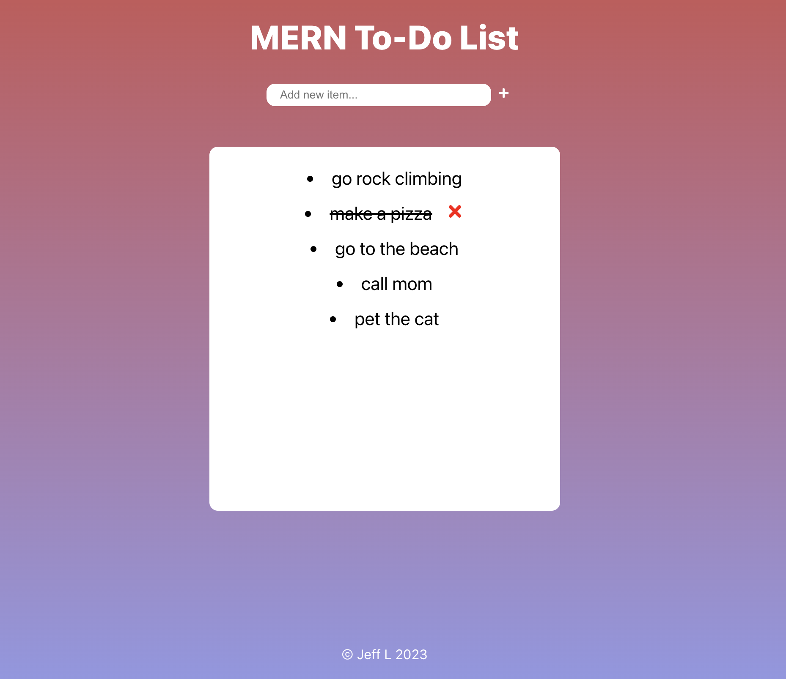

<h1> MERN To-Do List </h1>

# Overview
- [About the Project](#about-the-project)
- [Features](#features)
- [Videos & Screenshots](#videos-and-screenshots)
- [Built With](#built-with)
- [Authors](#authors)

## About The Project

A full-stack to-do list application built with MERN.

## Features
- CRUD functionality with Node JS, Express, Mongo DB. 
- React front end with minimalist UI/UX design. 
## Videos & Screenshots

## Built With 
* React
* NodeJS
* Express
* MongoDB 
## Authors
- **Jeff L** - [jlam3950](https://github.com/jlam3950)
